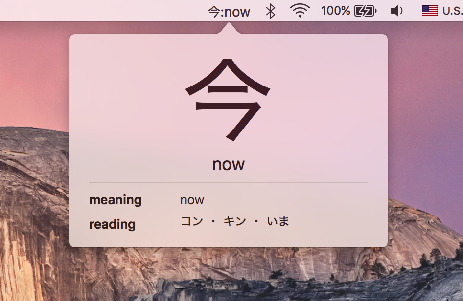

# KanjiGlance
Remember Kanji while you are working or doing something else on your desktop by just glace at the status bar.

### Todo
- [x] Add more Kanji sets
- [x] Settings to adjust time and select only some Kanji set
- [ ] Able to go back and forth
- [ ] ...

Pull Request are welcome!

## Credit

Kanji data from [http://tangorin.com/](http://tangorin.com/)

## Author

Amornchai Kanokpullwad, [@zoonref](https://twitter.com/zoonref)